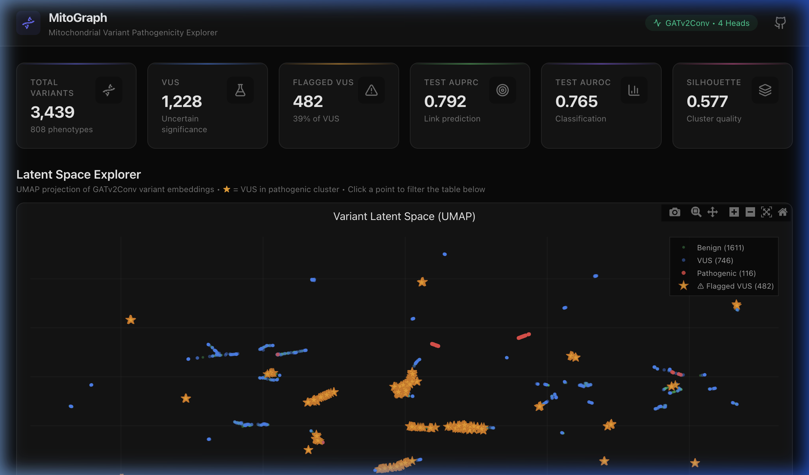
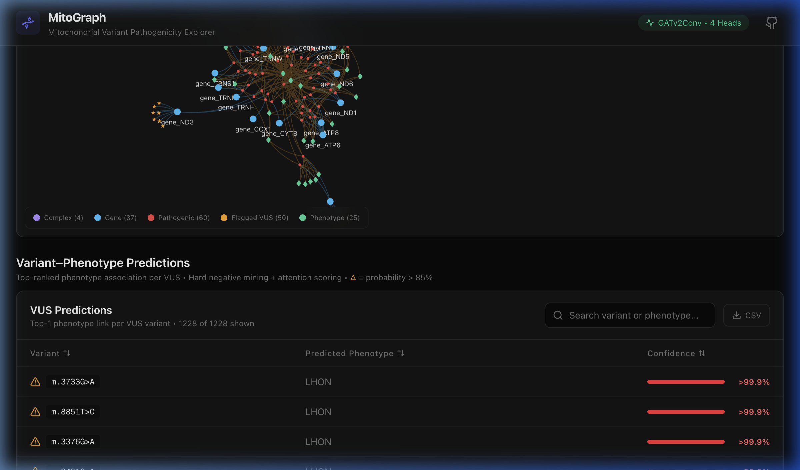

# MitoGraph: Mitochondrial Knowledge Graph for VUS Pathogenicity Prediction

A Graph ML pipeline that builds a heterogeneous Knowledge Graph from mitochondrial variant databases and uses link prediction to assess Variants of Uncertain Significance (VUS).

**🌐 [Live Dashboard →](https://mitomap-app.vercel.app/)**

## Overview

MitoGraph integrates three data sources - **RefSeq GFF3** (gene annotations), **ClinVar** (variant classifications), and **MITOMAP** (disease associations, conservation scores) - into a single Knowledge Graph. A Graph Neural Network (GATv2Conv-based heterogeneous encoder with attention) is trained on known pathogenic variant-phenotype associations, then used to predict potential disease links for VUS.

### Key Results
- **Test AUPRC: 0.792** | **Test AUROC: 0.789** | **Silhouette: 0.577**
- 1,228 VUS scored against 808 disease phenotypes
- 482 VUS flagged as potentially pathogenic (39%)

## Interactive Dashboard

The results are served through an interactive Next.js dashboard deployed on Vercel.

**Stats overview + UMAP latent space** - 2D projection of GATv2Conv variant embeddings colored by pathogenicity class. Flagged VUS (★) cluster with known pathogenic variants.

**Mitochondrial complex graph** - Force-directed layout of the knowledge graph hierarchy: Complexes → Genes → Variants → Phenotypes. Nodes are draggable, clickable, and color-coded by type.

**Dashboard source code:** [Shreyan-A0I/Mitomap-app](https://github.com/Shreyan-A0I/Mitomap-app)

## Graph Structure

| Node Type | Count | Features |
|-----------|-------|----------|
| Variant | 3,439 | PhyloP conservation, clinical significance, circular positional encoding, APOGEE/MitoTIP scores |
| Gene | 37 | Biotype (tRNA, rRNA, protein-coding) |
| Complex | 4 | Respiratory chain complex (I, III, IV, V) |
| Phenotype | 808 | Disease names from ClinVar + MITOMAP |

| Edge Type | Count | Description |
|-----------|-------|-------------|
| LOCATED_IN | 3,429 | Variant → Gene (positional overlap) |
| PART_OF | 13 | Gene → Complex (respiratory chain mapping) |
| ASSOCIATED_WITH | 620 | Variant → Phenotype (confirmed associations) |
| KMER_SIMILARITY | 7,437 | Variant ↔ Variant (4-mer cosine sim > 0.85, ±20bp circular window) |

### Node Feature Vectors

Each node type has a fixed-length feature vector fed to the GATv2Conv encoder:

**Variant (10D):**

| Dim | Feature | Source |
|-----|---------|--------|
| 0 | PhyloP conservation score | UCSC (median-imputed) |
| 1 | is_pathogenic | ClinVar one-hot |
| 2 | is_likely_pathogenic | ClinVar one-hot |
| 3 | is_benign | ClinVar one-hot |
| 4 | is_likely_benign | ClinVar one-hot |
| 5 | is_vus | ClinVar one-hot |
| 6 | sin(2π·pos/16569) | Circular position |
| 7 | cos(2π·pos/16569) | Circular position |
| 8 | APOGEE score | MITOMAP (0 if missing) |
| 9 | MitoTIP score | MITOMAP (0 if missing) |

**Gene (3D):** one-hot `[tRNA, rRNA, protein_coding]`

**Complex (4D):** one-hot `[I, III, IV, V]`

**Phenotype (64D):** Random unit-vector projection later shaped into something meaningful by GATv2Conv message passing during training

## Design Decisions

- **GATv2Conv + 4 Attention Heads**: Dynamic attention learns which neighbor edges matter most for pathogenicity prediction
- **Hard Negative Mining**: 1,611 benign variants forced to score 0.0 against all phenotypes, reduced VUS false-positive rate from 74% to 39%
- **Circular Positional Encoding**: mtDNA is circular; positions are encoded as `(sin(2π·pos/16569), cos(2π·pos/16569))` so position 16569 neighbors position 1
- **PhyloP Conservation**: 100-vertebrate basewise PhyloP scores from UCSC; missing values imputed with median (no 0.0 placeholders)
- **4-mer Similarity**: ±20bp windows on the circular genome; cosine similarity threshold of 0.85
- **Variant-Level Split**: Entire variants held out for val/test to prevent edge leakage through k-mer similarity edges
- **DBSCAN Clustering**: eps=0.4, min_samples=5 on UMAP embeddings to identify pathogenic clusters (Silhouette=0.577)

## Data Sources & Acknowledgements

MitoGraph's neuro-symbolic architecture relies on the expert curation and open-access data provided by the following institutions:

- **MITOMAP**: The definitive human mitochondrial genome database. MITOMAP provided the expertly curated variant-to-phenotype linkages, functional classifications (mmut, rtmut), and the machine-learning-derived APOGEE pathogenicity probabilities.
- **ClinVar (NCBI)**: A freely accessible, public archive of reports of the relationships among human variations and phenotypes. ClinVar provided the foundational baseline of clinical observations and the primary set of Variants of Uncertain Significance (VUS) for this project's predictive modeling.
- **rCRS (Revised Cambridge Reference Sequence)**: Sourced via NCBI RefSeq (NC_012920.1), this 16,569 bp sequence served as the physical coordinate system for the knowledge graph and k-mer similarity generation.
- **PhyloP (UCSC Genome Browser)**: Provided the base-by-base evolutionary conservation scores used as primary structural features for the Graph Attention Network.
